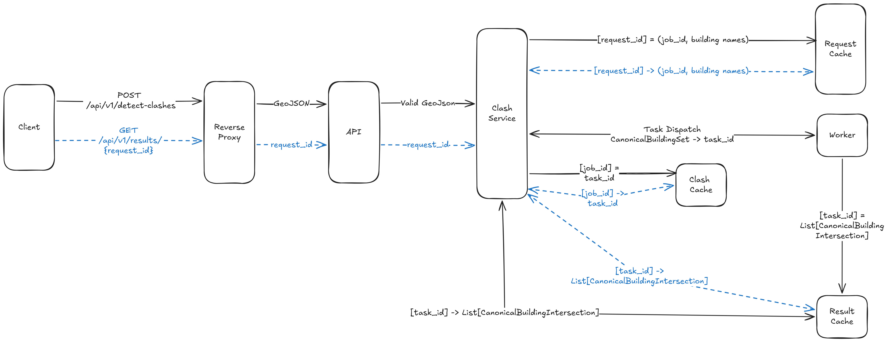
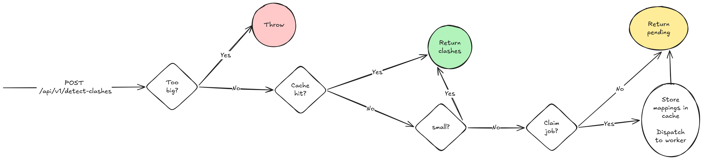
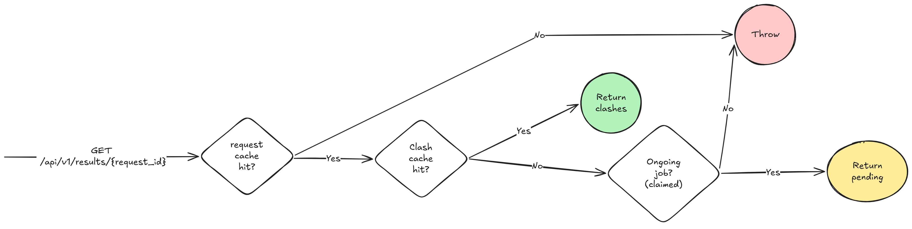
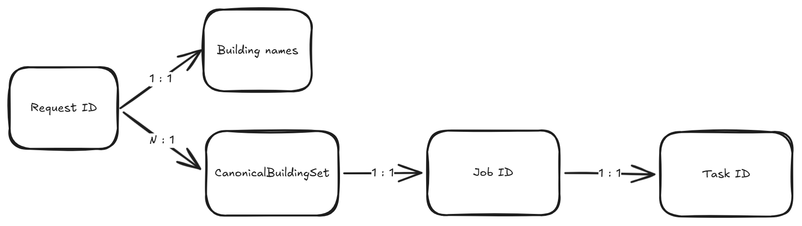
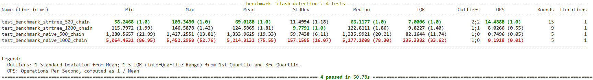

# Building Clashes Detection API

Backend service to detect 3D spatial overlaps between buildings with a 3D visualization frontend.

## Public Demo & API Docs

- **Minimal frontend for using the API:**
  - [http://ec2-13-61-127-143.eu-north-1.compute.amazonaws.com/](http://ec2-13-61-127-143.eu-north-1.compute.amazonaws.com/)
- **API docs:**
  - [http://ec2-13-61-127-143.eu-north-1.compute.amazonaws.com/docs](http://ec2-13-61-127-143.eu-north-1.compute.amazonaws.com/docs)

**If the above links are not accessible, try the direct IP address:**
- [http://13.61.127.143/](http://13.61.127.143/)

## Quick Start

```bash
# Build and run all services (API, Worker, Redis, Frontend)
docker-compose up --build
```

## Resetting All Docker Containers and Volumes

If you want to clear all containers, networks, and volumes and start fresh:

```bash
# Stop and remove all running containers, networks, and volumes defined in docker-compose
docker-compose down

# (Optional) Remove all stopped containers, unused networks, images, and volumes
docker system prune -af --volumes

# Rebuild and start all services
docker-compose up --build
```

## Services

| Service | URL | Description |
|---------|-----|-------------|
| API | http://localhost:8000 | REST API for clash detection |
| API Docs | http://localhost:8000/docs | Swagger documentation |
| Frontend | http://localhost:8080 | 3D visualization |

## API Endpoints

| Method | Endpoint | Description |
|--------|----------|-------------|
| POST | `/api/v1/detect-clashes` | Submit buildings for clash detection |
| GET | `/api/v1/results/{request_id}` | Poll for async results |

## Input Format

---

<!-- TODO: Expand this section with more details on input validations and schema requirements. -->

The API accepts as input a strict subset of the [RFC 7946](https://datatracker.ietf.org/doc/html/rfc7946) GeoJSON standard, with additional custom mandatory properties. Refer to the [API docs](http://localhost:8000/docs) for the full request schema.


###  Reflection 🤔
We could have considered using libraries such as **pydantic-geojson** or similar to handle GeoJSON schema enforcement more robustly. 


|    | Reflection |
|----|------------|
| ✅ | It would reduce boilerplate for standard GeoJSON structures. |
| ⚠️ | It would add noise to the schema. |
| ⚠️ | It would require extra validations to reject GeoJSON types we don't support.. |


## Architecture

### System Overview


### POST Flow


### GET Flow


### Data Model


## Technology Stack

- **Backend**: Python, FastAPI
- **Async Processing**: Celery, Redis
- **Geospatial**: Shapely, Pydantic
- **Frontend**: JavaScript (Three.js for 3D visualization)
- **Deployment**: Docker, Docker Compose, Nginx

## Project Structure

```
app/                    # Main application
├── algorithms/         # Clash detection logic
├── api/                # REST API endpoints
├── core/               # Configuration, caching, constants
├── mappers/            # Data transformation (GeoJSON ↔ Canonical)
├── models/             # Pydantic data models
├── services/           # Business logic layer
├── tasks/              # Celery async tasks
└── utils/              # Helper utilities

tests/                  # Test suite
frontend/               # 3D visualization UI
nginx/                  # Reverse proxy configuration
docker-compose.yml      # Multi-container orchestration
```

## Development

### Setting up Linters

To maintain code quality and consistency, this project uses **Pylint** and **Black** for linting and formatting.

**Install development dependencies:**
```bash
pip install -r requirements-dev.txt
```

**Run the linters:**
```bash
# Format code with Black
python -m black app/ tests/

# Check for linting issues with Pylint
python -m pylint app/
```

**Format before committing** to keep the codebase clean and consistent.

## Testing


```bash
# Run all tests
docker-compose run --rm api pytest tests/

# Run tests with verbose output
docker-compose run --rm api pytest tests/ -v

# Run functional tests
docker-compose run --rm api pytest tests/test_functional.py -v

# Run stress tests
docker-compose run --rm api pytest tests/test_stress.py -v
```

## Benchmarking

Run performance benchmarks to compare algorithms at different scales:

```bash
docker-compose run --rm api pytest tests/test_benchmark.py -v --benchmark-only
```

The benchmarks test chain-overlap scenarios with:
- **Naive Algorithm (O(n²))**: Pairwise comparison of all building polygons
- **STRtree Algorithm**: Spatial index-based optimization using Shapely's STRtree
- **Scales**: 500 and 1000 buildings to measure algorithmic efficiency

**Sample output:**




## Challenges and Resolutions

This project encountered several practical challenges during development; below is a concise summary and how we addressed each.

- **Intersection geometry types (lines/points):**
  - Challenge: Some building footprints only touch at edges or points. Shapely can return non-area geometries (LineString/Point) for these cases which are not meaningful "clashes".
  - Resolution: We only treat area intersections as clashes. The detector filters intersection geometries so only non-empty Polygons are accepted, discarding line/point intersections to avoid false positives. See [app/algorithms/clash_detector.py](app/algorithms/clash_detector.py).

- **Numeric precision and canonicalization:**
  - Challenge: Floating-point rounding and inconsistent polygon orientation caused flaky intersection results on real GeoJSON input.
  - Resolution: Inputs are quantized (scaled and rounded) and polygons are normalized to a canonical representation during mapping. This improves robustness and enables deterministic hashing. See [app/mappers/building_mapper.py](app/mappers/building_mapper.py).

- **Serialization & async processing:**
  - Challenge: Shapely geometry objects are not directly JSON-serializable, which complicates passing work to Celery workers and storing results in Redis.
  - Resolution: Canonical models serialize polygons to coordinate lists via Pydantic field serializers; we use `model_dump()` / `model_validate()` and JSON for safe transport/storage. Celery is configured to use JSON serializer on the worker side. See [app/models/canonical.py](app/models/canonical.py) and [tasks/celery_worker.py](tasks/celery_worker.py).

- **Performance & scaling:**
  - Challenge: Naïve pairwise checks are O(n²) and become very expensive as the number of buildings and polygon vertices increases (stress tests include very large vertex counts).
  - Resolution: All requests are checked for complexity ($n_{buildings} \times n_{vertices}$). If the complexity exceeds the maximum allowed threshold (currently 20,000,000), the request is rejected. Otherwise, the job is dispatched to a Celery worker for async processing. Results are cached using a canonical job id to avoid recomputation. See [app/services/clash_service.py](app/services/clash_service.py), [app/core/constants.py](app/core/constants.py), and [app/utils/job_id_generator.py](app/utils/job_id_generator.py).

- **Caching & duplicate-job prevention:**
  - Challenge: Multiple identical requests should not trigger duplicate heavy processing.
  - Resolution: We generate a canonical SHA256 job id for the normalized building set and use Redis keys (NX) to claim and dedupe jobs; original input IDs are stored so results can be mapped back to the caller.


**Known limitations / Future work:**

- **Complex geometry support:**
  MultiPolygon and GeometryCollection results are currently ignored (only simple area Polygons are returned). Expanding support for complex geometries would reduce dropped-but-relevant results.

- **Scalability for large datasets:**
  For very large datasets, consider the following strategies:
  - Parallelized naive (multi-core CPU): The current O(n²) algorithm can be parallelized across CPU cores to improve throughput for moderate dataset sizes. This divides the pairwise checks among workers but does not reduce the total number of comparisons.
  - 3D R-tree GPU-accelerated spatial join: For very large datasets, a more scalable approach is to use a spatial index (such as a 3D R-tree) to quickly filter candidate building pairs whose bounding boxes overlap. The remaining candidate pairs are then checked for true intersection using massively parallel GPU kernels. This dramatically reduces the number of expensive geometry checks and leverages GPU hardware for high throughput. Libraries such as RAPIDS cuSpatial or custom CUDA implementations can be used for this purpose.

- **Task routing by complexity:**
  Currently all tasks use a single Celery queue. For future scaling, consider implementing Celery task routing to separate small and large jobs into dedicated queues with tailored worker pool sizes. This would prevent large jobs from starving small jobs and enable fine-grained resource allocation. See [Celery task routing docs](https://docs.celeryproject.org/en/stable/userguide/routing.html) for implementation details.
